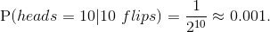

# Magic-Coin

This repository illustrates the fact that rare occurrences happen all the time. All you need is enough data to observe them.

This repository also illustrates how to use GitHub Actions to check solutions submitted by students.

## Rare events

The probability of flipping a heads in one toss of a fair coin is 0.5. If you flip a coin 10 times, we have

<!-- Use http://latex.codecogs.com/eqneditor/editor.php to convert to gif
\mbox{P}(heads=10|10~flips) = \frac{1}{2^{10}} \approx 0.001.
-->

I would not expect to flip a coin 10 times and get heads every time, but if I repeat the experiment over and over again, I would expect to get 10 heads in a row about 1 out of every 1,000 tries.

Likewise, using a random number generator, we would also expect to only observe 10 heads in a row about 1 in 1,000 attempts. The difference is that a random number generator isn't really random. If you set the random number generator seed, you will get the same result every time.

### Exercise

Edit the `find_magic_seed.R` script to identify a random seed, `s` that will result in 10 heads in a row. If you find a random seed that hasn't been reported, submit your code via a pull request, and I'll add your username and seed to the Hall of Fame below.

If you are curious how this might be done, you can look at the `solution` branch for one solution.

## GitHub Actions

GitHub recently released Actions to run pretty much any workflow you might dream up. Here I have created an action, [`Check Magic Seed`](https://github.com/johnsonra/Magic-Coin/blob/master/.github/workflows/check_magic_seed.yml), that will automatically check if the random seed defined in `find_magic_seed.R` actually results in 10 heads in a row whenever an update is pushed to the repository or when a pull request is submitted.

Essentially, the action starts up a VM with R installed and runs `check_magic_seed.R`. If `is_magic_coin(s)` returns `TRUE` the check passes, otherwise an error is thrown indicating that the specified random seed doesn't result in 10 heads in a row.

I'm also working on an action that compares a seed with those in the Hall of Fame below. If it is a unique seed, this README will automatically be updated with the username and the new seed.

## Hall of Fame

These users have identified the following random seeds that result in 10 heads in a row. If you find a unique seed, submit a pull request and I'll add your name to the list.

| User name | Seed |
| --------- | ---- |
| johnsonra | 72 |